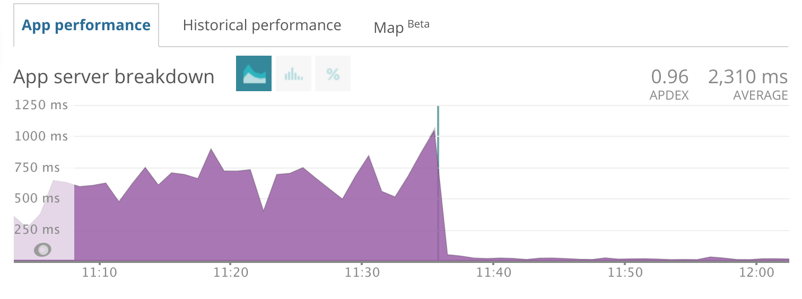

[](http://cultofmartians.com)
[](https://rubygems.org/gems/logidze)
[](https://github.com/palkan/logidze/actions)
[](https://www.codetriage.com/palkan/logidze)

# Logidze

Logidze provides tools for logging DB records changes when using PostgreSQL. Just like [audited](https://github.com/collectiveidea/audited) and [paper_trail](https://github.com/airblade/paper_trail) do (but [faster](bench/performance)).

Logidze allows you to create a DB-level log (using triggers) and gives you an API to browse this log.
The log is stored with the record itself in JSONB column. No additional tables required.

🤔 [How is Logidze pronounced?](https://github.com/palkan/logidze/issues/73)

Other requirements:

- Ruby ~> 2.7
- Rails >= 6.0 (for Rails 4.2 use version <=0.12.0, for Rails 5.x use version <= 1.2.3)
- PostgreSQL >= 10.0

<a href="https://evilmartians.com/">
</a>

## Links

- [Logidze 1.0: Active Record, Postgres, Rails, and time travel](https://evilmartians.com/chronicles/logidze-1-0-active-record-postgresql-rails-and-time-travel?utm_source=logidze)
- [Logidze: for all those tired of versioning data](https://evilmartians.com/chronicles/introducing-logidze?utm_source=logidze)

## Table of contents

- [Installation & Configuration](#installation)
  - [Using with schema.rb](#using-with-schemarb)
  - [Configuring models](#configuring-models)
  - [Backfill data](#backfill-data)
  - [Log size limits](#log-size-limits)
  - [Tracking only selected columns](#tracking-only-selected-columns)
  - [Logs timestamps](#logs-timestamps)
  - [Undoing a Generated Invocation](#undoing-a-generated-invocation)
  - [Using with partitioned tables](#using-with-partitioned-tables)
- [Usage](#usage)
  - [Basic API](#basic-api)
  - [Track meta information](#track-meta-information)
  - [Track responsibility](#track-responsibility)
  - [Disable logging temporary](#disable-logging-temporary)
  - [Reset log](#reset-log)
  - [Creating full snapshot instead of diffs](#full-snapshots)
  - [Associations versioning](#associations-versioning)
- [Dealing with large logs](#dealing-with-large-logs)
- [Handling records deletion](#handling-records-deletion)
- [Handling PG exceptions](#handling-pg-exceptions)
- [Upgrading](#upgrading)
- [Log format](#log-format)
- [Troubleshooting 🚨](#troubleshooting)
- [Development](#development)

## Installation

Add Logidze to your application's Gemfile:

```ruby
gem "logidze", "~> 1.1"
```

Install required DB extensions and create trigger function:

```sh
bundle exec rails generate logidze:install
```

This creates a migration for adding trigger function and enabling the hstore extension.

Run migrations:

```sh
bundle exec rails db:migrate
```

**NOTE:** Logidze uses DB functions and triggers, hence you need to use SQL format for a schema dump:

```ruby
# application.rb
config.active_record.schema_format = :sql
```

### Using with schema.rb

Logidze seamlessly integrates with [fx][] gem to make it possible to continue using `schema.rb` for the database schema dump.

Add `fx` gem to your Gemfile and run the same Logidze generators: `rails g logidze:install` or `rails g logidze:model`.

If for some reason Logidze couldn't detect the presence of Fx in your bundle, you can enforce it by passing `--fx` option to generators.

On the other hand, if you have `fx` gem but don't want Logidze to use it—pass `--no-fx` option.

### Configuring models

Run the following migration to enable changes tracking for an Active Record model and adding a `log_data::jsonb` column to the table:

```sh
bundle exec rails generate logidze:model Post
bundle exec rails db:migrate
```

This also adds `has_logidze` line to your model, which adds methods for working with logs.

By default, Logidze tries to infer the path to the model file from the model name and may fail, for example, if you have unconventional project structure. In that case, you should specify the path explicitly:

```sh
bundle exec rails generate logidze:model Post --path "app/models/custom/post.rb"
```

### Backfill data

To backfill table data (i.e., create initial snapshots) add `backfill` option to the generator:

```sh
bundle exec rails generate logidze:model Post --backfill
```

Now your migration should contain and `UPDATE ...` statement to populate the `log_data` column with the current state.

Otherwise a full snapshot will be created the first time the record is updated.

You can create a snapshot manually by performing the following query:

```sql
UPDATE <my_table> as t
SET log_data = logidze_snapshot(to_jsonb(t))
```

Or by using the following methods:

```ruby
Model.create_logidze_snapshot

# specify the timestamp column to use for the initial version (by default the current time is used)
Model.create_logidze_snapshot(timestamp: :created_at)

# filter columns
Model.create_logidze_snapshot(only: %w[name])
Model.create_logidze_snapshot(except: %w[password])

# or call a similar method (but with !) on a record

my_model = Model.find(params[:id])
my_model.create_logidze_snapshot!(timestamp: :created_at)
```

A snapshot is only created if `log_data` is null.

### Log size limits

You can provide the `limit` option to `generate` to limit the size of the log (by default it's unlimited):

```sh
bundle exec rails generate logidze:model Post --limit=10
```

### Tracking only selected columns

You can log only particular columns changes. There are mutually exclusive `except` and `only` options for this:

```sh
# track all columns, except `created_at` and `active`
bundle exec  rails generate logidze:model Post --except=created_at,active
# track only `title` and `body` columns
bundle exec rails generate logidze:model Post --only=title,body
```

### Logs timestamps

By default, Logidze tries to get a timestamp for a version from record's `updated_at` field whenever appropriate. If
your model does not have that column, Logidze will gracefully fall back to `statement_timestamp()`.

To change the column name or disable this feature completely, you can use the `timestamp_column` option:

```sh
# will try to get the timestamp value from `time` column
bundle exec rails generate logidze:model Post --timestamp_column time
# will always set version timestamp to `statement_timestamp()`
bundle exec rails generate logidze:model Post --timestamp_column nil # "null" and "false" will also work
```

### Undoing a Generated Invocation

If you would like to re-do your `rails generate` anew, as with other generators you can use `rails destroy` to revert it, which will delete the migration file and undo the injection of `has_logidze` into the model file:

```sh
bundle exec rails destroy logidze:model Post
```

**IMPORTANT**: If you use non-UTC time zone for Active Record (`config.active_record.default_timezone`), you MUST always infer log timestamps from a timestamp column (e.g., when back-filling data); otherwise, you may end up with inconsistent logs ([#199](https://github.com/palkan/logidze/issues/199)). In general, we recommend using UTC as the database time unless there is a very strong reason not to.

### Using with partitioned tables

Logidze supports partitioned tables for PostgreSQL 13+ without any additional configuration. For PostgreSQL 11/12, you should use _after_ triggers. To do that, provide the `--after-trigger` option to the migration:

```sh
bundle exec rails generate logidze:model Post --after-trigger
```

**NOTE:** Record changes are written as a full snapshot if the partition has changed during the update.

**IMPORTANT:** Using Logidze for partitioned tables in PostgreSQL 10 is not supported.

## Usage

### Basic API

Your model now has `log_data` column, which stores changes log.

To retrieve record version at a given time use `#at` or `#at!` methods:

```ruby
post = Post.find(27)

# Show current version
post.log_version #=> 3

# Show log size (number of versions)
post.log_size #=> 3

# Get copy of a record at a given time
post.at(time: 2.days.ago)

# or revert the record itself to the previous state (without committing to DB)
post.at!(time: "2018-04-15 12:00:00")

# If no version found
post.at(time: "1945-05-09 09:00:00") #=> nil
```

You can also get revision by version number:

```ruby
post.at(version: 2)
```

**NOTE:** If `log_data` is nil, `#at(time:)` returns self and `#at(version:)` returns `nil`.
You can opt-in to return `nil` for time-based `#at` as well by setting `Logidze.return_self_if_log_data_is_empty = false`.

It is also possible to get version for relations:

```ruby
Post.where(active: true).at(time: 1.month.ago)
```

You can also get diff from specified time:

```ruby
post.diff_from(time: 1.hour.ago)
#=> { "id" => 27, "changes" => { "title" => { "old" => "Logidze sucks!", "new" => "Logidze rulz!" } } }

# the same for relations
Post.where(created_at: Time.zone.today.all_day).diff_from(time: 1.hour.ago)
```

**NOTE:** If `log_data` is nil, `#diff_from` returns an empty Hash as `"changes"`.

Also, it is possible to retrieve list of model's `versions`:

```ruby
post.versions # => Enumerator

# you can use Enumerator's #take to return all
post.versions.take

# or you take a few or call any Enumerable method
post.versions.take(2)
post.versions.find do
  _1.title == "old title"
end

# we can also add options
post.versions(reverse: true) # from older to newer
post.versions(include_self: true) # returns self as the first one (default) or the last one record (if reverse: true)
```

There are also `#undo!` and `#redo!` options (and more general `#switch_to!`):

```ruby
# Revert record to the previous state (and stores this state in DB)
post.undo!

# You can now user redo! to revert back
post.redo!

# More generally you can revert record to arbitrary version
post.switch_to!(2)
```

You can initiate reloading of `log_data` from the DB:

```ruby
post.reload_log_data # => returns the latest log data value
```

Typically, if you update record after `#undo!` or `#switch_to!` you lose all "future" versions and `#redo!` is no
longer possible. However, you can provide an `append: true` option to `#undo!` or `#switch_to!`, which will
create a new version with old data. Caveat: when switching to a newer version, `append` will have no effect.

```ruby
post = Post.create!(title: "first post") # v1
post.update!(title: "new title") # v2
post.undo!(append: true) # v3 (with same attributes as v1)
```

Note that `redo!` will not work after `undo!(append: true)` because the latter will create a new version
instead of rolling back to an old one.
Alternatively, you can configure Logidze always to default to `append: true`.

```ruby
Logidze.append_on_undo = true
```

### Track meta information

You can store any meta information you want inside your version (it could be IP address, user agent, etc.). To add it you should wrap your code with a block:

```ruby
Logidze.with_meta({ip: request.ip}) do
  post.save!
end
```

**NOTE:** You should pass metadata as a Hash; passing keyword arguments doesn't work in Ruby 3.0+.

Meta expects a hash to be passed so you won't need to encode and decode JSON manually.

By default `.with_meta` wraps the block into a DB transaction. That could lead to an unexpected behavior, especially, when using `.with_meta` within an around_action. To avoid wrapping the block into a DB transaction use `transactional: false` option.

```ruby
Logidze.with_meta({ip: request.ip}, transactional: false) do
  post.save!
end
```

**Important:** If you use connection pooling (e.g., PgBouncer), using `.with_meta` without a transaction may lead to unexpected results (since meta is set for a connection). Without a transaction, we cannot guarantee that the same connection will be used for queries (including metadata cleanup).

**Important**: In Rails, `after_commit` callbacks are executed after transaction is committed, and, thus, after `with_meta` block is executed—the meta wouldn't be added to changes captured in the `after_commit` phase. One particular scenario is having associations with `touch: true` (_touch_ updates are executed after commit).

### Track responsibility

A special application of meta information is storing the author of the change, which is called _Responsible ID_. There is more likely that you would like to store the `current_user.id` that way.

To provide `responsible_id` you should wrap your code in a block:

```ruby
Logidze.with_responsible(user.id) do
  post.save!
end
```

And then to retrieve `responsible_id`:

```ruby
post.log_data.responsible_id
```

Logidze does not require `responsible_id` to be `SomeModel` ID. It can be anything. Thus Logidze does not provide methods for retrieving the corresponding object. However, you can easily write it yourself:

```ruby
class Post < ActiveRecord::Base
  has_logidze

  def whodunnit
    id = log_data.responsible_id
    User.find(id) if id.present?
  end
end
```

And in your controller:

```ruby
class ApplicationController < ActionController::Base
  around_action :use_logidze_responsible, only: %i[create update]

  def use_logidze_responsible(&block)
    Logidze.with_responsible(current_user&.id, &block)
  end
end
```

By default `.with_responsible` wraps the block into a DB transaction. That could lead to an unexpected behavior, especially, when using `.with_responsible` within an around_action. To avoid wrapping the block into a DB transaction use `transactional: false` option.

```ruby
Logidze.with_responsible(user.id, transactional: false) do
  post.save!
end
```

### Disable logging temporary

If you want to make update without logging (e.g., mass update), you can turn it off the following way:

```ruby
Logidze.without_logging { Post.update_all(seen: true) }

# or

Post.without_logging { Post.update_all(seen: true) }
```

### Reset log

Reset the history for a record (or records):

```ruby
# for a single record
record.reset_log_data

# for relation
User.where(active: true).reset_log_data
```

### Full snapshots

You can instruct Logidze to create a full snapshot instead of a diff for a particular log entry.

It could be useful in combination with `.without_logging`: first, you perform multiple updates without logging, then
you want to create a log entry with the current state. To do that, you should use the `Logidze.with_full_snapshot` method:

```ruby
record = Model.find(params[:id])

Logidze.without_logging do
  # perform multiple write operations with record
end

Logidze.with_full_snapshot do
  record.touch
end
```

### Associations versioning

Logidze also supports associations versioning. This feature is disabled by default (due to the number of edge cases). You can learn more
in the [wiki](https://github.com/palkan/logidze/wiki/Associations-versioning).

## Dealing with large logs

By default, Active Record _selects_ all the table columns when no explicit `select` statement specified.

That could slow down queries execution if you have field values which exceed the size of the data block (typically 8KB). PostgreSQL turns on its [TOAST](https://wiki.postgresql.org/wiki/TOAST) mechanism), which requires reading from multiple physical locations for fetching the row's data.

If you do not use compaction (`generate logidze:model ... --limit N`) for `log_data`, you're likely to face this problem.

Logidze provides a way to avoid loading `log_data` by default (and load it on demand):

```ruby
class User < ActiveRecord::Base
  # Add `ignore_log_data` option to macros
  has_logidze ignore_log_data: true
end
```

If you want Logidze to behave this way by default, configure the global option:

```ruby
# config/initializers/logidze.rb
Logidze.ignore_log_data_by_default = true

# or

# config/application.rb
config.logidze.ignore_log_data_by_default = true
```

However, you can override it by explicitly passing `ignore_log_data: false` to the `ignore_log_data`.
You can also enforce loading `log_data` in-place by using the `.with_log_data` scope, e.g. `User.all.with_log_data` loads all
the _users_ with `log_data` included.

The chart below shows the difference in PG query time before and after turning `ignore_log_data` on. (Special thanks to [@aderyabin](https://github.com/aderyabin) for sharing it.)



If you try to call `#log_data` on the model loaded in such way, you'll get `nil`. If you want to fetch log data (e.g., during the console debugging)–use **`user.reload_log_data`**, which forces loading this column from the DB.

## Handling records deletion

Unlike, for example, PaperTrail, Logidze is designed to **only track changes**. If the record has been deleted, **everything is lost**.

If you want to keep changes history after records deletion as well, consider using specialized tools for soft-delete, such as, [Discard](https://github.com/jhawthorn/discard) or [Paranoia](https://github.com/rubysherpas/paranoia).

See also the discussion: [#61](https://github.com/palkan/logidze/issues/61).

## Handling PG exceptions

By default, Logidze raises an exception which causes the entire transaction to fail.
To change this behavior, it's now possible to override `logidze_capture_exception(error_data jsonb)` function.

For example, you may want to raise a warning instead of an exception and complete the transaction without updating log_data.

Related issues: [#193](https://github.com/palkan/logidze/issues/193)

## Upgrading

We try to make an upgrade process as simple as possible. For now, the only required action is to create and run a migration:

```sh
bundle exec rails generate logidze:install --update
```

This updates core `logdize_logger` DB function. No need to update tables or triggers.

**NOTE:** When using `fx`, you can omit the `--update` flag. The migration containing only the updated functions would be created.

If you want to update Logidze settings for the model, run migration with `--update` flag:

```sh
bundle exec rails generate logidze:model Post --update --only=title,body,rating
```

You can also use the `--name` option to specify the migration name to avoid duplicate migration names:

```sh
$ bundle exec rails generate logidze:model Post --update --only=title,body,rating --name add_only_filter_to_posts_log_data

    create db/migrate/20202309142344_add_only_filter_to_posts_log_data.rb
```

### Pending upgrade check [Experimental]

Logidze can check for a pending upgrade. Use `Logidze.on_pending_upgrade = :warn` to be notified by warning, or `Logidze.on_pending_upgrade = :raise` if you want Logidze to raise an error.

### Upgrading from 0.x to 1.0 (edge)

#### Schema and migrations

Most SQL function definitions have changed without backward compatibility.
Perform the following steps to upgrade:

1. Re-install Logidze: `bundle exec rails generate logidze:install --update`.

1. Re-install Logidze triggers **for all models**: `bundle exec rails generate logidze:model <model> --update`.

   **NOTE:** If you had previously specified whitelist/blacklist attributes, you will need to include the `--only`/`--except` [option](#tracking-only-selected-columns) as appropriate. You can easily copy these column lists from the previous logidze migration for the model.

1. Remove the `include Logidze::Migration` line from the old migration files (if any)—this module has been removed.

Rewrite legacy logidze migrations to not use the `#current_setting(name)` and `#current_setting_missing_supported?` methods, or copy them from the latest [0.x release](https://github.com/palkan/logidze/blob/0-stable/lib/logidze/migration.rb).

#### API changes

The deprecated `time` positional argument has been removed from `#at` and `#diff_from` methods. Now you need to use keyword arguments, i.e., `model.at(some_tome) -> model.at(time: some_time)`.

## Log format

The `log_data` column has the following format:

```js
{
  "v": 2, // current record version,
  "h": // list of changes
    [
      {
        "v": 1,  // change number
        "ts": 1460805759352, // change timestamp in milliseconds
        "c": {
            "attr": "new value",  // updated fields with new values
            "attr2": "new value"
            },
        "r": 42, // Resposibility ID (if provided), not in use since 0.7.0
        "m": {
          "_r": 42 // Resposibility ID (if provided), in use since 0.7.0
          // any other meta information provided, please see Track meta information section for the details
        }
      }
    ]
}
```

If you specify the limit in the trigger definition, then log size will not exceed the specified size. When a new change occurs, and there is no more room for it, the two oldest changes will be merged.

## Troubleshooting

### `log_data` is nil when using Rails fixtures

Rails fixtures are populated with triggers disabled. Thus, `log_data` is null initially for all records.
You can use `#create_logidze_snapshot` manually to build initial snapshots.

### How to make this work with Apartment 🤔

First, read [Apartment docs](https://github.com/influitive/apartment#installing-extensions-into-persistent-schemas) on installing PostgreSQL extensions. You need to use the described approach to install Hstore (and drop the migration provided by Logidze during installation).

Secondly, set `config.use_sql = true` in the Apartment configuration.

Finally, when using `fx` along with `schema.rb`, you might face a problem with duplicate trigger definitions (for different schemas).
Here is a patch to fix this: [dump_triggers.rake](etc/dump_triggers.rake).

Related issues: [#50](https://github.com/palkan/logidze/issues/50).

### `PG::UntranslatableCharacter: ERROR`

That could happen when your row data contain null bytes. You should sanitize the data before writing to the database.
From the [PostgreSQL docs](https://www.postgresql.org/docs/current/datatype-json.html): `jsonb type also rejects \u0000 (because that cannot be represented in PostgreSQL's text type)`.

Related issues: [#155](https://github.com/palkan/logidze/issues/155).

### `pg_restore` fails to restore a dump

First, when restoring data dumps you should consider using `--disable-triggers` option (unless you have a strong reason to invoke the triggers).

When restoring data dumps for a particular PostgreSQL schema (e.g., when using Apartment), you may encounter the issue with non-existent Logidze functions. That happens because `pg_dump` adds `SELECT pg_catalog.set_config('search_path', '', false);`, and, thus, breaks our existing triggers/functions, because they live either in "public" or in a tenant's namespace (see [this thread](https://postgrespro.com/list/thread-id/2448092)).

### `PG::NumericValueOutOfRange: ERROR: value overflows numeric format`

Due to the usage of `hstore_to_jsonb_loose` under the hood, there could be a situation when you have a string representing a number in the scientific notation (e.g., "557236406134e62000323100"). Postgres would try to convert it to a number (a pretty big one, for sure) and fail with the exception.

Related issues: [#69](https://github.com/palkan/logidze/issues/69).

## Development

This project requires a PostgreSQL instance running with the following setup:

```sh
# For testing
createdb -h postgres -U postgres logidze_test

# For benchmarks
createdb -h postgres -U postgres logidze_bench
createdb -h postgres -U postgres logidze_perf_bench
psql -d logidze_bench -c 'CREATE EXTENSION IF NOT EXISTS hstore;'
```

This project is compatible with [Reusable Docker environment](https://evilmartians.com/chronicles/reusable-development-containers-with-docker-compose-and-dip) setup.

## Contributing

Bug reports and pull requests are welcome on GitHub at [https://github.com/palkan/logidze](https://github.com/palkan/logidze).

## License

The gem is available as open source under the terms of the [MIT License](http://opensource.org/licenses/MIT).

[fx]: https://github.com/teoljungberg/fx
